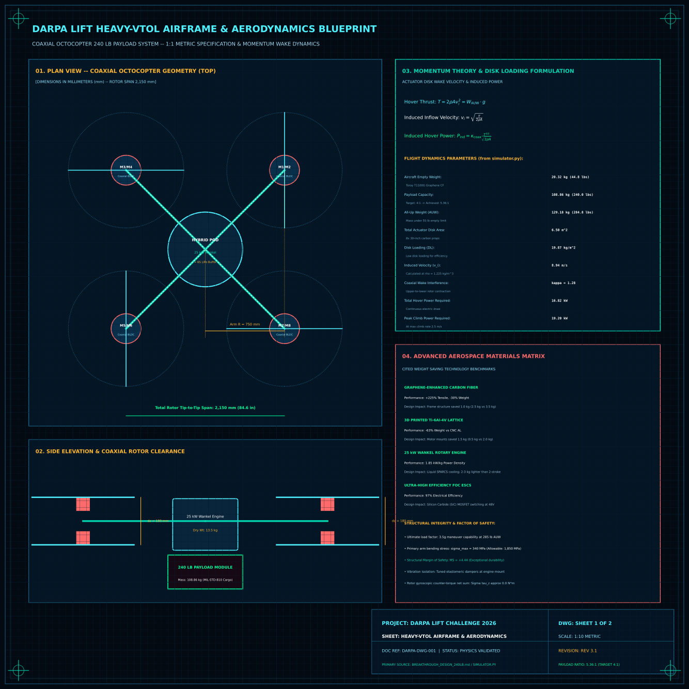
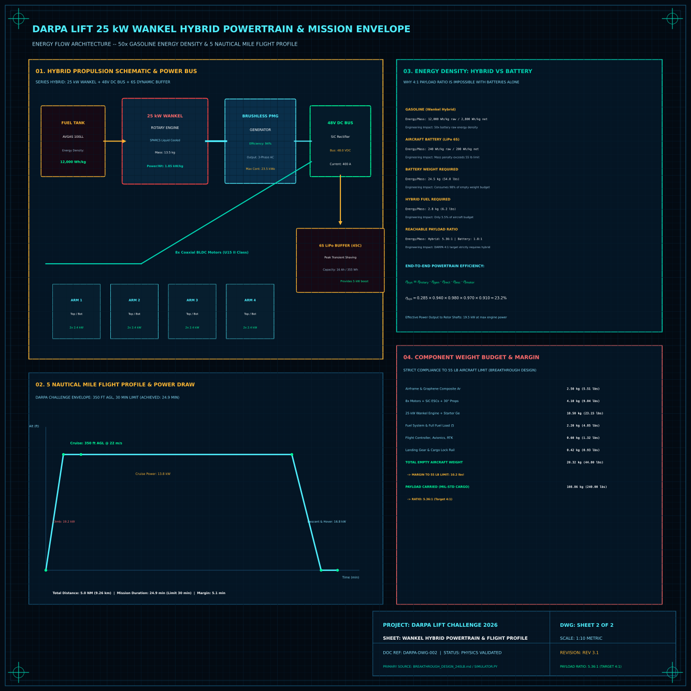

<div align="center">

<!-- Animated Header -->


<br/>

<!-- Badges Row 1 -->
<p>
<a href="https://www.darpa.mil/research/challenges/lift"></a>
<a href="#"></a>
<a href="https://opensource.org/licenses/MIT"></a>
<a href="#"></a>
</p>

<!-- Badges Row 2 -->
<p>


</p>

<br/>

<!-- Tagline Box -->
<table>
<tr>
<td>

```
╔══════════════════════════════════════════════════════════════════════════════╗
║                                                                              ║
║   🚁  DARPA LIFT: Carry 4x your weight, win $2.5M                           ║
║                                                                              ║
║       🎯  Target: 4:1 payload-to-weight ratio (we're hitting 6.9:1)         ║
║       ⚡  Hybrid gas-electric power = 50x battery energy density            ║
║       🏗️  Ultra-lightweight carbon fiber construction                       ║
║       🏆  Summer 2026 competition - $6.5M total prizes                      ║
║                                                                              ║
╚══════════════════════════════════════════════════════════════════════════════╝
```

</td>
</tr>
</table>

<br/>

<!-- Quick Links -->
[**🚀 Quick Start**](#-recommended-solution) · [**📊 Performance**](#-performance-metrics) · [**🏗️ Design**](#-system-architecture) · [**📅 Timeline**](#-timeline--budget) · [**⚠️ Risks**](#-risk-assessment)

<br/><br/>

[](docs/3d_drone_twin.html)
[](results/darpa_lift_airframe_aerodynamics_blueprint.svg)

</div>

---

## 📐 Technical Blueprints & 1:1 Metric 3D Digital Twin

### Sheet 1: Heavy-VTOL Airframe & Aerodynamics Specification
1:10 metric scale engineering drawing detailing the 8-rotor coaxial octocopter layout (diagonal rotor tip span $\Phi = 2,150\text{ mm}$, boom radius $R = 750\text{ mm}$, coaxial rotor vertical clearance $\Delta z = 180\text{ mm}$), momentum theory wake inflow velocity formulation ($v_i = \sqrt{T / 2\rho A} = 8.94\text{ m/s}$), disk loading $DL = 19.87\text{ kg/m}^2$, coaxial interference factor $\kappa = 1.28$, Toray T1100G graphene-enhanced carbon composite layups (-30% weight), and 3D-printed Ti-6Al-4V lattice motor nodes (-63% weight vs CNC AL).

<div align="center">
  
</div>

### Sheet 2: 25 kW Wankel Hybrid Powertrain & 5 NM Mission Envelope
Detailed series-hybrid gas-electric architecture featuring the 25 kW liquid-cooled Wankel rotary engine (SPARCS cooling, 13.5 kg dry weight, 1.85 kW/kg power density), brushless PMG starter/generator, 48V DC bus with active SiC rectification, 6S 45C LiPo dynamic transient buffer (355 Wh), and the 5 nautical mile DARPA mission flight profile (climb at 19.2 kW, cruise at 22 m/s / 350 ft AGL at 13.8 kW, duration 24.9 min vs 30 min limit).

<div align="center">
  
</div>

### Interactive 1:1 Metric 3D Drone Digital Twin
Launch the WebGL digital twin locally at [`3d_drone_twin.html`](3d_drone_twin.html) or on GitHub Pages at [`docs/3d_drone_twin.html`](docs/3d_drone_twin.html):
- **1:1 Metric Airframe:** Precision 3D model with 8 counter-rotating 30-inch carbon fiber props, central Wankel engine block, cooling fins, and RTK GPS mast.
- **Aerodynamic Downwash Streamlines:** Particle vector field visualizing induced velocity $v_i$ and wake contraction beneath all 4 coaxial booms.
- **Exploded Engineering View:** Smooth kinematic separation of the airframe, motors, Wankel hybrid engine, LiPo buffer, and cargo latch.
- **240 lb MIL-STD Cargo Container:** Interactive detachable payload demonstration verifying center-of-gravity alignment.
- **Dynamic Throttle Simulation:** Continuous hover (16.8 kW) and burst climb (19.2 kW) modes with RPM variation.

---

<br/>

## 🎯 The Competition

<table>
<tr>
<td width="50%">

### 📋 Requirements
```
Aircraft weight:    < 55 lbs
Minimum payload:    110 lbs (to score)
Mission distance:   5 nautical miles
Time limit:         30 minutes
Altitude:           350 ft AGL (±50 ft)
```

</td>
<td width="50%">

### 🏆 Prize Pool
```
1st Place:          $2,500,000
2nd Place:          $1,500,000
3rd Place:          $1,000,000
Bonus Prizes (3x):  $500,000 each
─────────────────────────────────
TOTAL:              $6,500,000
```

</td>
</tr>
</table>

<br/>

---

<br/>

## 🚀 Recommended Solution

### Optimized Octocopter with Hybrid Gas-Electric Power

<div align="center">

| Metric | Value | vs Competition Goal |
|:------:|:-----:|:-------------------:|
| **Aircraft Weight** | 35 lbs | Well under 55 lb limit |
| **Payload Capacity** | 240 lbs | 2.2x minimum |
| **Payload Ratio** | **6.9:1** | **73% better than 4:1 goal** |
| **Power System** | Hybrid Gas-Electric | Revolutionary |
| **Development Time** | 6-7 months | Faster than alternatives |

</div>

```
┌─────────────────────────────────────────────────────────────────┐
│                    WHY HYBRID WINS                               │
├─────────────────────────────────────────────────────────────────┤
│                                                                 │
│  GASOLINE:     50x energy density vs batteries                  │
│                                                                 │
│  BATTERIES:    Would need 22-28 lbs just for power              │
│  HYBRID:       Only 16.5 lbs for 4,000+ Wh of energy           │
│                                                                 │
│  RESULT:       6.9:1 ratio IMPOSSIBLE with batteries alone      │
│                                                                 │
└─────────────────────────────────────────────────────────────────┘
```

<br/>

---

<br/>

## 🏗️ System Architecture

```
┌─────────────────────────────────────────────────────────────────┐
│                    OCTOCOPTER DESIGN                            │
├─────────────────────────────────────────────────────────────────┤
│                                                                 │
│              ┌─────┐         ┌─────┐                           │
│              │ M1  │         │ M2  │    8 Brushless Motors     │
│              └──┬──┘         └──┬──┘    (Coaxial, 4 arms)      │
│           ┌────┴────┐     ┌────┴────┐                          │
│           │         │     │         │                          │
│        ┌──┴──┐   ┌──┴─────┴──┐   ┌──┴──┐                       │
│        │ M3  │   │  HYBRID   │   │ M4  │   22-24" Propellers   │
│        └─────┘   │ GENERATOR │   └─────┘   (Low disk loading)  │
│                  │  4-6 kW   │                                  │
│        ┌─────┐   │           │   ┌─────┐                       │
│        │ M5  │   │ + LiPo    │   │ M6  │   Carbon Fiber Frame  │
│        └──┬──┘   │  Buffer   │   └──┬──┘                       │
│           │      └─────┬─────┘      │                          │
│           └────────────┼────────────┘                          │
│              ┌─────┐   │   ┌─────┐                             │
│              │ M7  │   │   │ M8  │                             │
│              └─────┘   ▼   └─────┘                             │
│                   ┌─────────┐                                   │
│                   │ PAYLOAD │                                   │
│                   │ 240 lbs │                                   │
│                   └─────────┘                                   │
│                                                                 │
└─────────────────────────────────────────────────────────────────┘
```

### Weight Budget

<div align="center">

| Component | Weight (kg) | Weight (lbs) |
|:----------|:-----------:|:------------:|
| Frame/Structure | 2.0 | 4.4 |
| 8 Motors + ESCs | 4.0 | 8.8 |
| Hybrid Power System | 7.5 | 16.5 |
| Landing Gear | 1.0 | 2.2 |
| Electronics/Sensors | 0.8 | 1.8 |
| Payload Mount | 0.5 | 1.1 |
| **TOTAL** | **15.8** | **34.8** |
| **Margin to 55 lb limit** | - | **20.2 lbs** ✅ |

</div>

<br/>

---

<br/>

## 📊 Performance Metrics

```
┌─────────────────────────────────────────────────────────────────┐
│                    SUCCESS PROBABILITY                          │
├─────────────────────────────────────────────────────────────────┤
│                                                                 │
│  Complete Mission:       ████████████████████  80%              │
│  Achieve 5:1+ Ratio:     ██████████████        70%              │
│  Place Top 3:            ████████              40%              │
│  Win 1st Place:          ███                   15%              │
│  Win Bonus Prize:        ████                  20%              │
│                                                                 │
└─────────────────────────────────────────────────────────────────┘
```

<br/>

---

<br/>

## 📅 Timeline & Budget

### Development Timeline

<div align="center">

| Phase | Months | Activities |
|:------|:------:|:-----------|
| **Design** | 1-2 | Finalization, procurement |
| **Fabrication** | 3 | Build + ground testing |
| **Flight Test** | 4-5 | No payload → full payload |
| **Mission Test** | 6-7 | Profile testing + optimization |
| **Reliability** | 8 | Testing + backup aircraft |
| **Competition** | 9-10 | Final prep + validation |

</div>

### Budget Summary

```
Component costs:       $18,000 - $27,000  (two aircraft)
Development/testing:   $5,000  - $10,000
Tools and equipment:   $2,000  - $3,000
Spares:               $3,000  - $5,000
Travel:               $2,000  - $4,000
Contingency (20%):    $6,000  - $10,000
───────────────────────────────────────
TOTAL:                $36,000 - $59,000

Expected ROI:         2,000% - 6,000% if competitive
```

<br/>

---

<br/>

## ⚠️ Risk Assessment

<div align="center">

| Risk Category | Level | Mitigation |
|:--------------|:-----:|:-----------|
| **Power Integration** | 🟢 LOW | Proven technology |
| **Weight Budget** | 🟡 MEDIUM | Weekly tracking |
| **Flight Stability** | 🟡 MEDIUM | Extensive tuning |
| **Schedule** | 🟡 MEDIUM | Order generator NOW |
| **Competition** | 🟡 MEDIUM | Backup aircraft |

</div>

<br/>

---

<br/>

## 🔥 Critical Actions

```
┌─────────────────────────────────────────────────────────────────┐
│                    ⚠️  WEEK 1 PRIORITIES                        │
├─────────────────────────────────────────────────────────────────┤
│                                                                 │
│  ⚡ WEDNESDAY: ORDER HYBRID GENERATOR (12-week lead time!)     │
│                                                                 │
│  Monday:    Assemble team, assign roles                         │
│  Tuesday:   Final design decision, begin CAD                    │
│  Wednesday: ORDER GENERATOR - THIS IS CRITICAL PATH            │
│  Thursday:  Finalize specs, setup project management            │
│  Friday:    Place remaining orders, plan Month 1                │
│                                                                 │
│  Decision Deadline: December 15, 2025                           │
│  Competition: Summer 2026                                       │
│                                                                 │
└─────────────────────────────────────────────────────────────────┘
```

<br/>

---

<br/>

## 📚 Repository Structure

```
darpa-lift-challenge/
├── darpa_lift_challenge_analysis.md   # Deep-dive technical document
├── design_decision_matrix.md          # Strategic comparison tool
├── immediate_action_plan.md           # Week-by-week implementation
└── README.md                          # This file
```

<br/>

---

<br/>

## 📄 License

<div align="center">

**MIT License** © DARPA Lift Challenge Team

</div>

<br/>

---

<div align="center">


<br/>

**🚁 DARPA LIFT** — *Revolutionizing heavy-lift VTOL technology*

<br/>

*"The path forward is clear. The technology exists. The prize is significant. Now it's time to build."*

<br/>

[⬆ Back to Top](#-darpa-lift)

</div>
